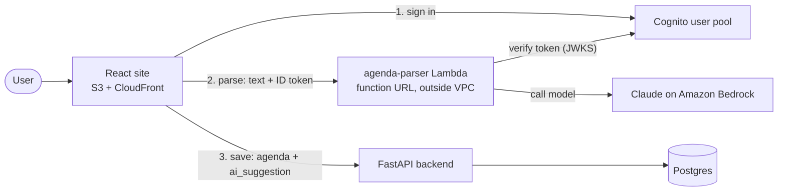

# Containers (C4 level 2)

```mermaid
flowchart LR
    user([User]) --> web[React site<br/>S3 + CloudFront]
    web -- "1. sign in" --> cognito[Cognito user pool]
    web -- "2. parse: text + ID token" --> parser[agenda-parser Lambda<br/>function URL, outside VPC]
    parser -- "verify token (JWKS)" --> cognito
    parser -- "call model" --> bedrock[Claude on Amazon Bedrock]
    web -- "3. save: agenda + ai_suggestion" --> api[FastAPI backend]
    api --> db[(Postgres)]
```

parse: browser → parser → Bedrock (never writes).
save: browser → API → database (the only write path).
